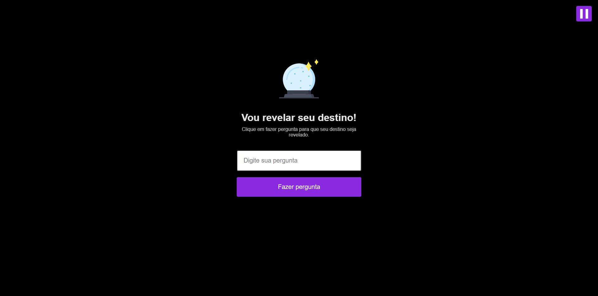

# 🚀 Maratona Explorer
<p align="center"></p>

<p align="center">Projeto da 1° edição da <a href="https://rseat.in/Aula1-Maratona-Explorer">Maratona Explorer</a>, evento gratuito criado pela <a href="https://www.rocketseat.com.br">Rocketseat</a>, onde construimos uma aplicação completa do zero.</p>
<p align="center"> - Notion: https://efficient-sloth-d85.notion.site/Maratona-Explorer-a90d9b149e2e40c8863d0732007fa05d </p>

### Projeto: *Maratona Explorer Vou revelar seu destino!*
<p align="center"></p>

## 🚀 Tecnologias Usadas
- HTML
- CSS
- JavaScript

## Instalação

```terminal
$ git clone https://github.com/filipedev8/maratonaExplorer.git

$ cd maratonaExplorer

$ Open with Live Server
```
